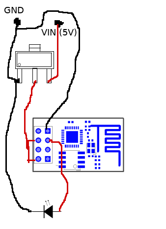
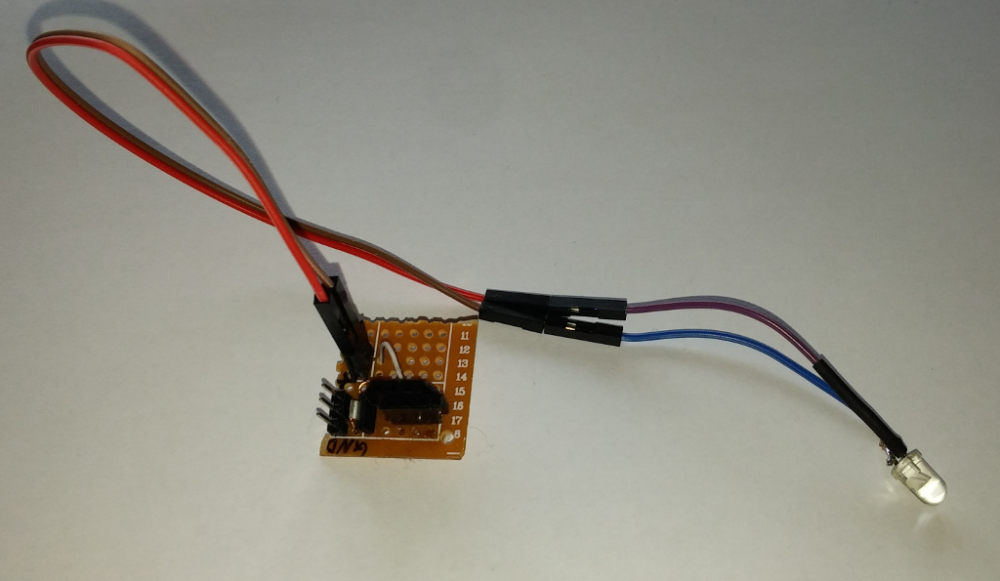
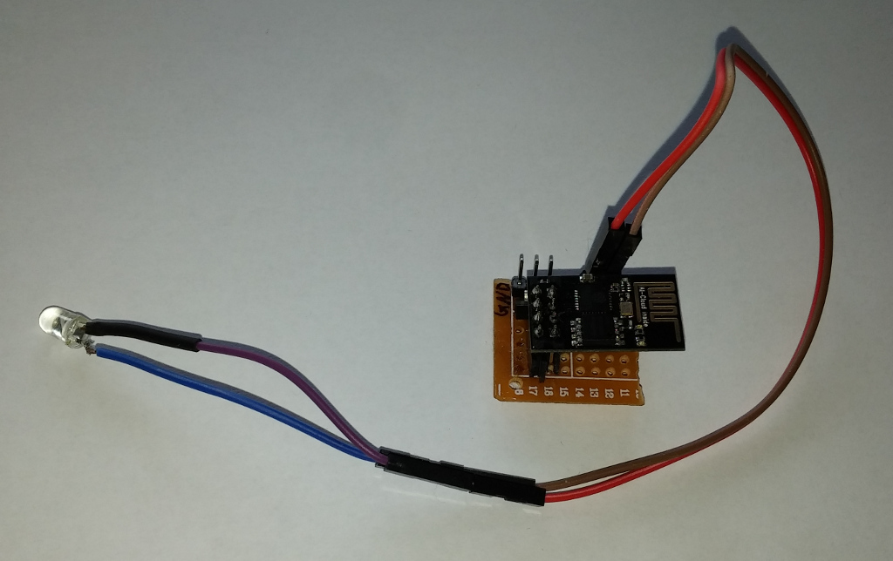

IR remotes are great. You don't have to get up from the couch to switch channel, they are cheap or you can always buy some [universal ones](https://en.wikipedia.org/wiki/Universal_remote). But they also have some downsides, you have to see the reciever, they are restricted by range, and somtimes you just can't find that thing ;)

I had some ESP8266 laying around so why not use it to replace my old remotes?

First I used arduino, IR reciever and [IRrecvDumpV2](https://github.com/z3t0/Arduino-IRremote/blob/master/examples/IRrecvDumpV2/IRrecvDumpV2.ino) to decode my radio and TV remote signals.
Then, after some research, turns out, that there is no lua library for sending IR codes. I didn't want build one by myself, so I decided to use [Arduino IDE](https://github.com/esp8266/Arduino) with  [IRremoteESP8266](https://github.com/markszabo/IRremoteESP8266) and [Arduino MQTT](https://github.com/256dpi/arduino-mqtt) libraries.
Parts list:
  - ESP8266
  - AMS1117 3.3V (voltage regulator)
  - IR emitting diode (from broken remote)
  - some wires and goldpins
  - universal dotted PCB

Like you see, the circuit it's just ESP8266 connected to diode (with voltage regulator).

I hava a [MQTT](https://mqtt.org/) [Mosquitto](https://mosquitto.org/) broker setup on my home server, so controlling is super easy.
You can find [code here](./mqtt-ir-remote.ino).

### Update 2016-10-13
I've added 4.7kΩ resistor between IR diode and ESP8266 to protect the board.